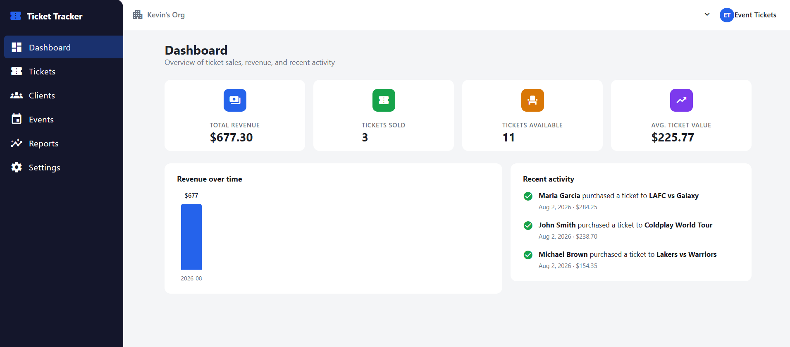
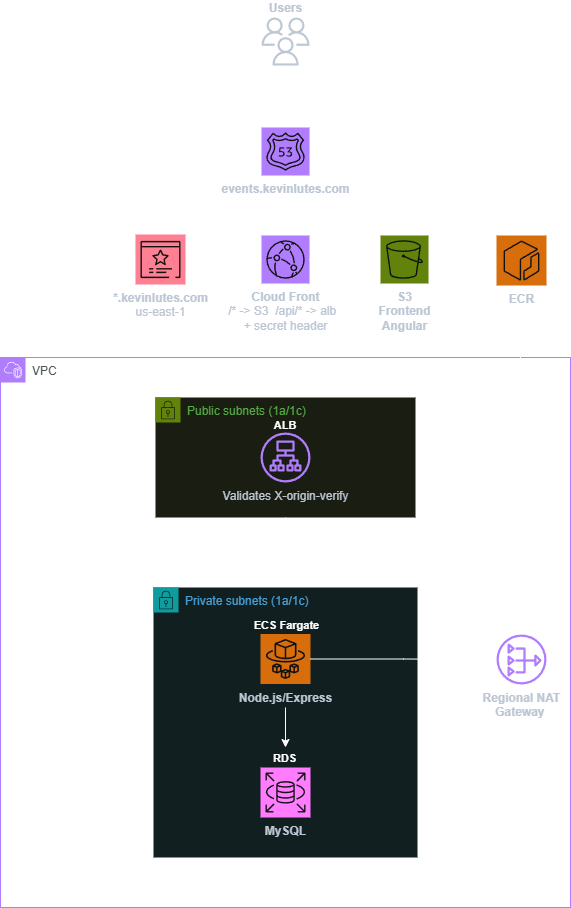
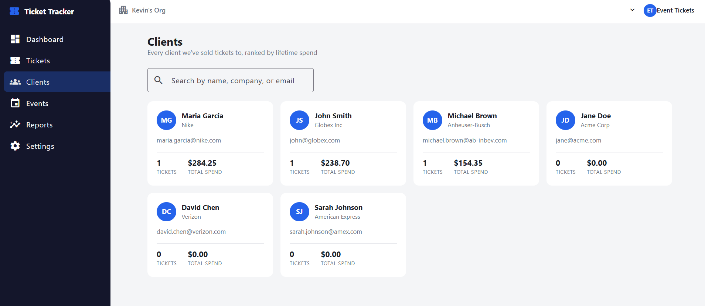
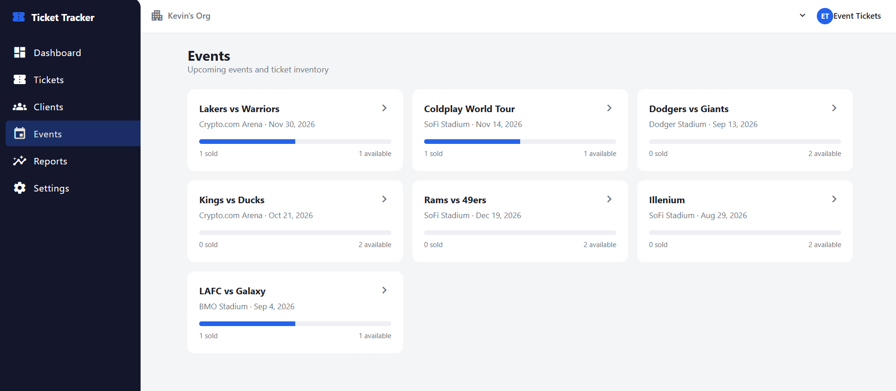
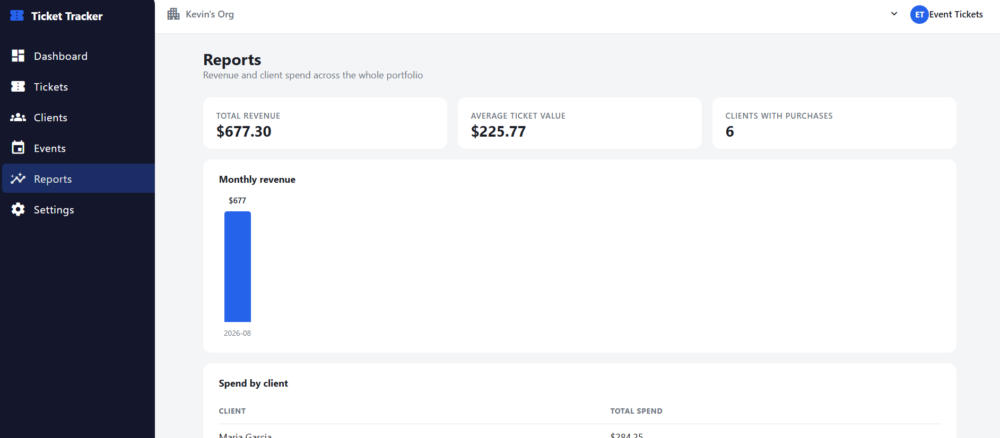
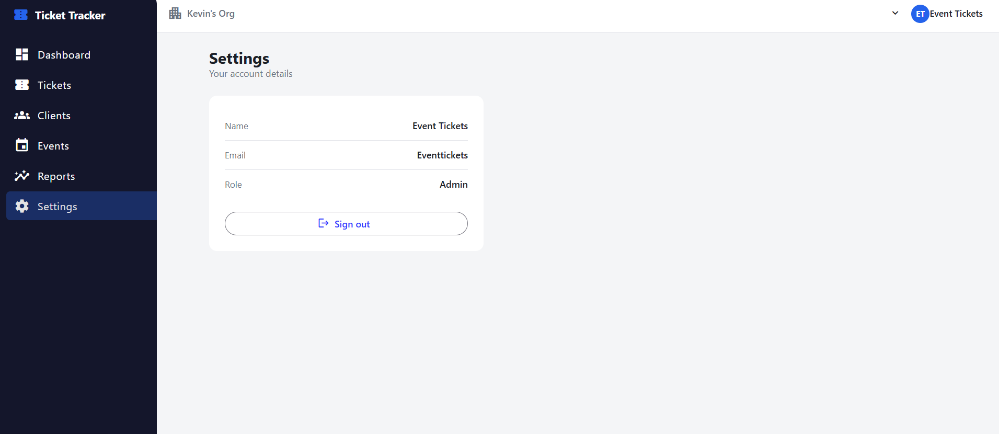
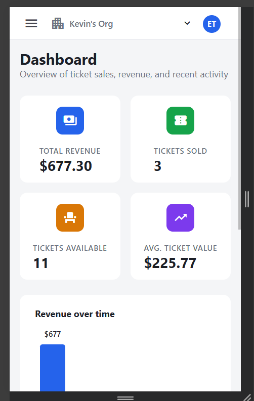
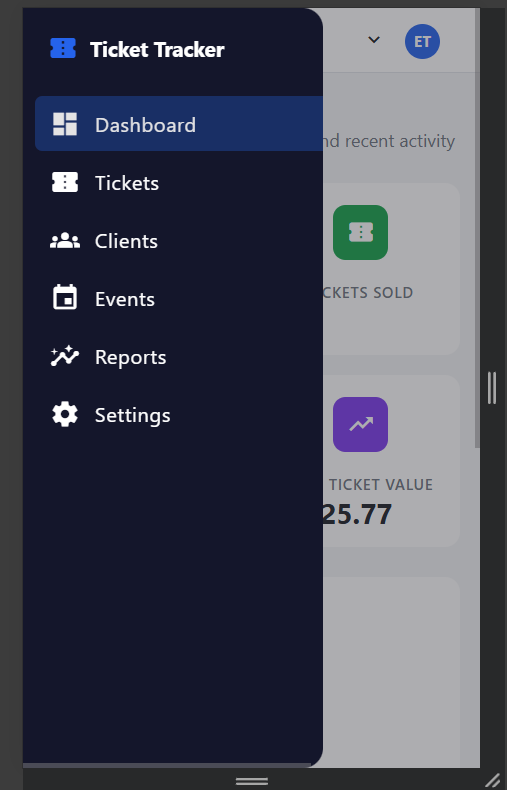

# 🎟️ Event Ticket Tracker: Full-Stack AWS Deployment

A full-stack application for tracking event tickets and client assignments. It models the kind of client-entertainment ticketing workflow used by companies that manage live event inventory and hospitality at scale.

**Live demo:** https://events.kevinlutes.com
**Demo login:** `eventtickets` / `password`

---

## ✨ Features

- User authentication with JWT
- Role-based authorization
- Ticket inventory management
- Client management
- Event management
- Reporting dashboard
- Search, filtering, sorting and pagination
- Bulk ticket assignment
- Responsive Angular Material UI
- Installable Progressive Web App

---

## 📈 Before → After

The app went through two builds. Part 1 proved out the AWS infrastructure and a basic working create/read/update workflow behind a shared API key. Part 2 rebuilt the application layer into something closer to a real internal SaaS tool, with per-user auth, a reporting layer, and a full UI redesign.

| | Part 1: Initial Build | Part 2: Production-Grade SaaS |
|---|---|---|
| **UI** | Single-page form, no navigation | Sidebar-navigated app: dashboard, tickets, clients, events, reports, settings |
| **Auth** | Shared `X-API-Key` header | Per-user JWT login, bcrypt-hashed passwords, role-based authorization |
| **Data** | Events, clients, tickets | + ROI tracking (spend by client, spend over time, avg ticket value) |
| **Frontend** | Plain HTML/CSS | Angular Material, responsive (mobile hamburger nav), installable PWA |
| **Infra security** | RDS unencrypted, single IAM role, plaintext env secrets | RDS encrypted at rest, split IAM roles, secrets in SSM Parameter Store |




---

## 🏗️ Architecture Overview



- **Frontend:** Angular (standalone components, Angular Material), served from S3 via CloudFront, installable as a PWA
- **Backend:** Node.js + Express REST API, containerized and running on ECS Fargate behind an Application Load Balancer
- **Database:** MySQL on RDS, encrypted at rest, in a private subnet with no public access
- **Networking:** Custom VPC with public/private subnets. I put RDS and ECS in private subnets with no inbound route from the internet, and added a NAT Gateway purely so the API container can still reach out (npm registry, AWS APIs) without ever being reachable from outside
- **Security:** CloudFront attaches a secret `X-Origin-Verify` header on every request to the ALB, and the ALB rejects any request without it, preventing traffic from bypassing CloudFront and hitting the load balancer directly. At the application layer, every `/api` route requires a signed JWT issued at login, mutating routes are further restricted by role, requests are rate-limited per IP, and CORS is restricted to the live frontend origin
- **Secrets:** Database credentials and the JWT signing secret are stored in SSM Parameter Store and resolved into the ECS task at container start, never written into the task definition as plaintext
- **Infrastructure as Code:** Entire stack defined in Terraform (VPC, RDS, ECS, ALB, ECR, S3, CloudFront, ACM, Route 53, IAM, SSM)

---

## 🛠️ Tech Stack

| Layer | Technology |
|---|---|
| Frontend | Angular, TypeScript, Angular Material |
| Backend | Node.js, Express |
| Auth | JWT (jsonwebtoken), bcrypt |
| Database | MySQL (Amazon RDS, encrypted at rest) |
| Compute | Amazon ECS (Fargate) |
| CDN / Static hosting | CloudFront, S3 |
| Secrets | AWS SSM Parameter Store |
| IaC | Terraform |
| DNS / TLS | Route 53, ACM |

---

## 📁 Project Structure

```
event-ticket-tracker/
├── backend/
│   ├── index.js
│   ├── auth.js
│   ├── db/
│   │   ├── migrations/
│   │   └── seed/
│   ├── scripts/
│   │   ├── create-user.js
│   │   ├── migrate.js
│   │   └── seed.js
│   ├── package.json
│   └── Dockerfile
├── frontend/
│   ├── src/
│   │   └── app/
│   │       ├── layout/       # sidebar + top nav shell
│   │       ├── dashboard/    # executive dashboard
│   │       ├── tickets/      # data table: sort/filter/search/bulk actions
│   │       ├── clients/      # CRM-style client cards
│   │       ├── events/       # event list + ticket inventory detail
│   │       ├── reports/
│   │       ├── settings/
│   │       └── login/
│   └── angular.json
├── infra/
│   ├── versions.tf
│   ├── network.tf
│   ├── security_groups.tf
│   ├── rds.tf
│   ├── ecr.tf
│   ├── alb.tf
│   ├── ecs.tf
│   ├── frontend.tf
│   ├── domain.tf
├── screenshots/
└── README.md
```

---

## 🔑 Key Design Decisions

**Data Model**

Four related tables: `events` (name, venue, date), `clients` (name, company, email), `tickets` (references an event and optionally a client, tracks `status` of `available` or `assigned`, `price`, `ticket_type`, and `purchased_at`), and `users` (email, bcrypt password hash, name, role).

Ticket assignment is modeled as an **update**, not an insert. Tickets exist as inventory tied to an event, and assigning a client changes an existing ticket's status rather than fabricating a new record. This reflects how ticket assignment actually works in practice: companies hold blocks of tickets and distribute them to clients, they don't create tickets on demand.

**Parameterized SQL Queries**

Every query in the API uses parameterized statements throughout, to prevent SQL injection. This includes the reporting/aggregation endpoints added in Part 2.

**Private-Subnet-First Infrastructure**

I designed this so RDS and ECS tasks have no direct internet exposure at all. Only the ALB and CloudFront sit in public subnets. Even if someone found the database endpoint, there's no network path to it from outside the VPC, so the only way in is through the app itself.

**X-Origin-Verify Pattern**

CloudFront attaches a secret header to every request it forwards to the ALB, and the ALB's listener rule rejects anything without it. This closes off the ALB's public DNS name as a bypass route, so the only way to reach the API is through CloudFront, even though the ALB technically has a public address.

**Application-Layer Security**

Infrastructure-level verification (X-Origin-Verify) confirms a request came through CloudFront, but it doesn't say anything about who's making the request. Every `/api` route requires a valid, signed JWT issued at login; mutating routes (creating or assigning tickets) additionally require the `admin` role. `POST /tickets` and `PUT /tickets/:id/assign` also validate their inputs (required fields, a `status` restricted to `available`/`assigned`, and `price` required to be a positive number) rather than trusting the request body outright. CORS is scoped to the live frontend origin instead of allowing any site to call the API from a browser, and all `/api` routes are rate-limited per IP, with a stricter limit on the login endpoint specifically to blunt credential-stuffing attempts.

**ECS Fargate Over EC2**

I chose Fargate because the API is stateless and I wanted deployments to consist of pushing a new image to ECR and letting ECS replace running tasks automatically, without maintaining EC2 instances, patching an OS, or managing an Auto Scaling Group myself.

---

## ✅ App Walkthrough

### Dashboard
The landing page after login. Shows total revenue, tickets sold, tickets still available, and average ticket value as KPI cards, a revenue-over-time chart, and a feed of the most recent ticket purchases.


### Tickets
The main workspace for managing inventory. A searchable, filterable, sortable, paginated table of every ticket across every event, with status badges (available/assigned), checkboxes for selecting multiple rows at once, and a bulk "assign to client" action alongside a quick per-row assign.


### Clients
A CRM-style card view of every client, showing their company, ticket count, and lifetime spend, sorted highest-spend first, with a search box to filter by name/company/email.



### Events
A grid of upcoming events with an inventory bar showing sold vs. available tickets at a glance. Clicking into an event shows a donut chart of sold/available, total revenue from that event, and the full ticket list for it.



### Reports
A dedicated reporting page: total revenue, average ticket value, and a count of clients who've bought tickets, a monthly revenue chart, and a full spend-by-client breakdown table.



### Settings
Shows the logged-in user's name, email, and role, with a sign-out button.



### Mobile
The whole app is responsive. The sidebar collapses into a hamburger menu overlay on small screens, and it installs to a phone's home screen as a standalone app (PWA).




### Security in Action
The ALB rejects any request that doesn't come through CloudFront's secret header check:


---

## 📚 What I Learned

This project expanded my experience beyond cloud infrastructure into application development, giving me hands-on experience with Node.js, SQL, and Angular in a production-style environment.

- Designing a relational schema from scratch, including tables, foreign keys, and the difference between a raw ID column and an actual join that resolves it to something meaningful
- Building a REST API in Node.js and Express, including routes, parameterized queries, the GET/POST/PUT distinction, and why an assignment should be an update rather than an insert
- Angular fundamentals, including standalone components, services and dependency injection, the newer `@for` control flow, and two-way binding on a real form
- How the layers of a containerized full-stack app map to AWS networking and security boundaries
- Writing an entire stack in Terraform from scratch, including VPC, subnets, RDS, ECS, ALB, ECR, CloudFront, S3, ACM, and Route 53
- Fronting both a static frontend and a private backend with a single CloudFront distribution, using path-based routing to send traffic to different origins
- Implementing the X-Origin-Verify pattern to prevent an ALB's public DNS name from becoming a security bypass
- Getting a shell into a running ECS Fargate task with ECS Exec, and why that's the correct way to reach a properly private RDS instance from outside its VPC
- The difference between infrastructure-layer verification and application-layer authentication. X-Origin-Verify proves a request came through CloudFront, but proving *who* is calling the API is a separate concern that needs its own layer

---

## 🔍 Monitoring & Support Workflow

Since debugging a live system is different from building one, this section documents the actual troubleshooting workflow I used and would use again:

- **CloudWatch logs** for application-level errors. This is the first place to check when the API returns an unexpected status, since the container's `console.error` output shows the exact query and error code (this is how the missing-tables issue and the SSL/certificate error were both diagnosed)
- **ECS service events** for deployment-level issues. `describe-services` surfaces exactly why a task is cycling (failed health check, image pull failure, etc.) before you ever need to touch the running container
- **ALB target group health checks** as the first signal something's wrong. A target flipping unhealthy narrows the problem to either the app itself or a networking/config mismatch, before spending time in logs
- **ECS Exec** to get a shell inside a running task when the problem needs to be reproduced live, whether that's checking environment variables, testing a database connection directly, or confirming what the container can actually reach on the network
- **Validating connectivity at the network boundary** when a task can't reach RDS, checking the security group chain and subnet routing before assuming it's an application bug, since a "can't connect" error can originate from either layer

If a client reported tickets not appearing, my first steps would be checking CloudWatch for a 500 or a SQL error, cross-referencing recent ECS deployments to rule out a bad release, then checking the ALB target group health if the whole service seems down rather than one query. This mirrors the workflow I used to trace a health-check failure back to a route-prefix mismatch and, separately, diagnose a "connected but no data" issue caused by an unseeded database.

---

## 🚀 Part 2: From Initial Build to Production-Grade SaaS

The first pass proved out the infrastructure and a working create/read/update flow behind a shared API key. For Part 2, I used Claude Code as an agentic pair to plan and implement a round of new features and harden the security of what was already deployed. It was a deliberate way to get hands-on with agentic AI-assisted development itself, on top of learning the subject matter. At a high level:

- **Per-user login** replacing the shared API key: a real `users` table, hashed passwords, and JWT-based sessions instead of one shared secret
- **ROI reporting**: spend by client, spend over time, and average ticket value, surfaced as KPI cards and a chart on the dashboard
- **A full UI redesign** using Angular Material: sidebar navigation, a proper dashboard, a sortable/filterable tickets table with bulk actions, a client roster, and per-event ticket inventory views
- **PWA support**: installable to a phone's home screen with an app icon and offline caching
- **A security hardening pass**: encrypting the database, moving secrets out of plaintext config and into AWS's secret store, and tightening IAM permissions and authentication checks

I intentionally used Claude Code as an agentic development partner to accelerate implementation while taking time to understand each architectural decision and security improvement before adopting it. This project was as much about learning how to collaborate effectively with AI as it was about building the application itself.

---

## 🤖 A Note on AI Assistance

**Part 1** split cleanly along a line I kept intentional. The cloud architecture and the Terraform behind it (the VPC layout, the subnet/security-group design, the X-Origin-Verify pattern, and how the whole AWS stack fits together) was my own work, reasoned through and written myself rather than generated. Claude came in on the application side, as a learning and debugging partner while I worked through Angular concepts and troubleshooting issues surfaced in CloudWatch logs and ECS service events, and on decisions like modeling ticket assignment as an update rather than an insert.

**Part 2** was a deliberate shift in how I used AI on this project: I worked with Claude Code as an agentic collaborator to plan and implement the new features and the security hardening pass, including having it run Terraform and AWS CLI commands directly against my infrastructure under my direction. The goal was to get fluent with agentic AI-assisted development as a skill in its own right, not just to ship features faster. JWT authentication was new to me, so I used this project as an opportunity to learn it properly. I reviewed the generated code, tested the complete authentication flow, and made sure I understood how the pieces fit together before adopting the implementation.
