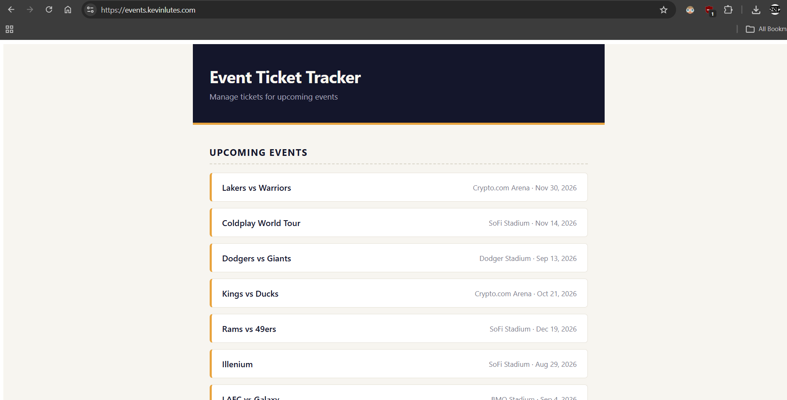
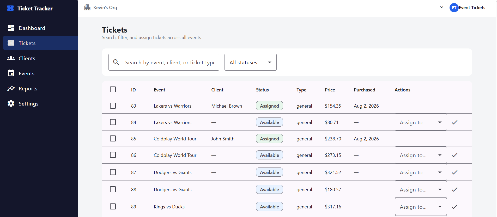
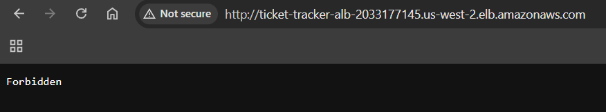

# 🎟️ Event Ticket Tracker: Full-Stack AWS Deployment

A full-stack application for tracking event tickets and client assignments. It models the kind of client-entertainment ticketing workflow used by companies that manage live event inventory and hospitality at scale.

**Live demo:** https://events.kevinlutes.com

---

## 🏗️ Architecture Overview


- **Frontend:** Angular (standalone components, `@for` control flow), served from S3 via CloudFront
- **Backend:** Node.js + Express REST API, containerized and running on ECS Fargate behind an Application Load Balancer
- **Database:** MySQL on RDS, in a private subnet with no public access
- **Networking:** Custom VPC with public/private subnets, NAT Gateway for outbound access from private resources
- **Security:** CloudFront attaches a secret `X-Origin-Verify` header on every request to the ALB. The ALB rejects any request without it, preventing traffic from bypassing CloudFront and hitting the load balancer directly
- **Infrastructure as Code:** Entire stack defined in Terraform (VPC, RDS, ECS, ALB, ECR, S3, CloudFront, ACM, Route 53)

---

## 🛠️ Tech Stack

| Layer | Technology |
|---|---|
| Frontend | Angular, TypeScript |
| Backend | Node.js, Express |
| Database | MySQL (Amazon RDS) |
| Compute | Amazon ECS (Fargate) |
| CDN / Static hosting | CloudFront, S3 |
| IaC | Terraform |
| DNS / TLS | Route 53, ACM |

---

## 📁 Project Structure

```
event-ticket-tracker/
├── backend/
│   ├── index.js
│   ├── package.json
│   └── Dockerfile
├── frontend/
│   ├── src/
│   └── angular.json
├── infra/
│   ├── versions.tf
│   ├── network.tf
│   ├── security_groups.tf
│   ├── rds.tf
│   ├── ecr.tf
│   ├── alb.tf
│   ├── ecs.tf
│   ├── frontend.tf
│   ├── domain.tf
├── screenshots/
└── README.md
```

---

## 🔑 Key Design Decisions

**Data Model**

Three related tables: `events` (name, venue, date), `clients` (name, company, email), and `tickets` (references an event and optionally a client, tracks `status` of `available` or `assigned`, and `price`).

Ticket assignment is modeled as an **update**, not an insert. Tickets exist as inventory tied to an event, and assigning a client changes an existing ticket's status rather than fabricating a new record. This reflects how ticket assignment actually works in practice: companies hold blocks of tickets and distribute them to clients, they don't create tickets on demand.

**Parameterized SQL Queries**

Every query in the API uses parameterized statements throughout, to prevent SQL injection.

**Private-Subnet-First Infrastructure**

RDS and ECS tasks have no direct internet exposure. Only the ALB and CloudFront are public-facing.

**X-Origin-Verify Pattern**

CloudFront attaches a secret header to every request it forwards to the ALB, and the ALB's listener rule rejects anything without it. This closes off the ALB's public DNS name as a bypass route, so the only way to reach the API is through CloudFront, even though the ALB technically has a public address.

**ECS Fargate Over EC2**

Fargate removes server maintenance and provides repeatable, container-based deployments, making it a good fit for a stateless API. It's the better fit for this kind of workload going forward, even with EC2 remaining the right call elsewhere.

---

## ✅ Validation

### Live Dashboard


### Ticket Assignments


### Security in Action
The ALB rejects any request that doesn't come through CloudFront's secret header check:


---

## 📚 What I Learned

This project expanded my experience beyond cloud infrastructure into application development, giving me hands-on experience with Node.js, SQL, and Angular in a production-style environment.

- Designing a relational schema from scratch, including tables, foreign keys, and the difference between a raw ID column and an actual join that resolves it to something meaningful
- Building a REST API in Node.js and Express, including routes, parameterized queries, the GET/POST/PUT distinction, and why an assignment should be an update rather than an insert
- Angular fundamentals, including standalone components, services and dependency injection, the newer `@for` control flow, and two-way binding on a real form
- How the layers of a containerized full-stack app map to AWS networking and security boundaries
- Writing an entire stack in Terraform from scratch, including VPC, subnets, RDS, ECS, ALB, ECR, CloudFront, S3, ACM, and Route 53
- Fronting both a static frontend and a private backend with a single CloudFront distribution, using path-based routing to send traffic to different origins
- Implementing the X-Origin-Verify pattern to prevent an ALB's public DNS name from becoming a security bypass
- Getting a shell into a running ECS Fargate task with ECS Exec, and why that's the correct way to reach a properly private RDS instance from outside its VPC

---

## 🔍 Monitoring & Support Workflow

Since debugging a live system is different from building one, this section documents the actual troubleshooting workflow I used and would use again:

- **CloudWatch logs** for application-level errors. This is the first place to check when the API returns an unexpected status, since the container's `console.error` output shows the exact query and error code (this is how the missing-tables issue and the SSL/certificate error were both diagnosed)
- **ECS service events** for deployment-level issues. `describe-services` surfaces exactly why a task is cycling (failed health check, image pull failure, etc.) before you ever need to touch the running container
- **ALB target group health checks** as the first signal something's wrong. A target flipping unhealthy narrows the problem to either the app itself or a networking/config mismatch, before spending time in logs
- **ECS Exec** to get a shell inside a running task when the problem needs to be reproduced live, whether that's checking environment variables, testing a database connection directly, or confirming what the container can actually reach on the network
- **Validating connectivity at the network boundary** when a task can't reach RDS, checking the security group chain and subnet routing before assuming it's an application bug, since a "can't connect" error can originate from either layer

If a client reported tickets not appearing, my first steps would be checking CloudWatch for a 500 or a SQL error, cross-referencing recent ECS deployments to rule out a bad release, then checking the ALB target group health if the whole service seems down rather than one query. This mirrors the workflow I used to trace a health-check failure back to a route-prefix mismatch and, separately, diagnose a "connected but no data" issue caused by an unseeded database.

---

## 🤖 A Note on AI Assistance

I used Claude throughout this project as a learning and debugging partner while working through Angular concepts and troubleshooting issues surfaced in CloudWatch logs and ECS service events. The architecture decisions, including the VPC layout, the X-Origin-Verify security pattern, and modeling ticket assignment as an update rather than an insert, were mine, and I worked through the reasoning behind each piece of infrastructure as it went in, rather than treating any of it as a black box.
